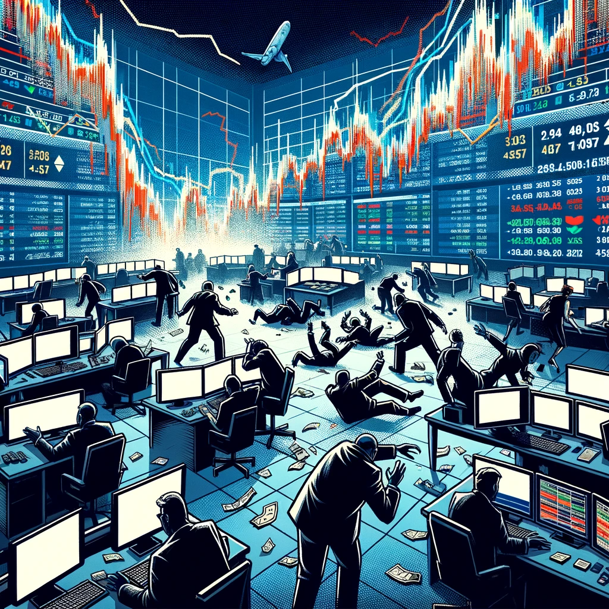

# Introduction

Statistical analysis, a pivotal tool in the realm of economics, offers profound insights and guides essential policy decisions. My academic journey in economics, deeply intertwined with understanding and applying statistical methods, has allowed me to appreciate their significance in analyzing economic trends and patterns. This article delves into the fundamentals of statistical analysis in economics, examines its application through case studies, and discusses the challenges and emerging opportunities in this field.

# The Fundamentals of Statistical Analysis in Economics

Economics, at its core, is about understanding and predicting human behavior in resource allocation. To do this effectively, economists rely on statistical analysis. Key methods include:

- **Econometrics**: This melds statistical tools with economic theory to test hypotheses and forecast future trends. Econometric models can dissect complex economic phenomena into understandable components. For example, an econometric model might analyze how changes in interest rates affect consumer spending.

- **Regression Analysis**: This statistical method is crucial for understanding relationships between different economic variables. For instance, economists use regression models to determine how factors like education levels and technological advancement impact a country's GDP.

- **Time Series Analysis**: This is particularly vital for analyzing trends over time. Economists use time series analysis to track and forecast cyclical economic patterns, like inflation rates or stock market trends.

These statistical methods are not just academic exercises; they're applied in real-world economic research. For example, regression analysis helps in understanding the impact of minimum wage increases on employment levels. Time series analysis, on the other hand, is often used in forecasting economic indicators crucial for central bank policy decisions.

# Case Studies

## The 2008 Financial Crisis

The 2008 financial crisis serves as a profound case study where statistical analysis played a critical role. Statistical tools like regression and time series analysis were pivotal in unpacking the crisis. Economists used these tools to understand the factors leading to the housing market collapse and to assess its impact on the global economy.

The analysis highlighted the role of high-risk mortgage lending and the subsequent failure of financial instruments. The insights gained from this analysis were crucial in shaping the regulatory and policy responses to stabilize the global financial system.

## Economic Response to COVID-19

The COVID-19 pandemic triggered an unprecedented global economic downturn. Economists and policymakers employed statistical analysis to strategize recovery plans. Econometric models were crucial in this regard, helping to predict the pandemic's impact on different sectors and evaluate the effectiveness of various stimulus packages.

For example, time series analysis was used to track the pandemic's impact on unemployment rates. This helped in understanding which sectors were most affected and how stimulus measures could be targeted for maximum effectiveness.

# Challenges and Opportunities

Despite its invaluable contributions, statistical analysis in economics faces several challenges. Data limitations, such as incomplete or biased data sets, can significantly impact the accuracy of analyses. Additionally, the complex and often non-linear relationships in economics make modeling and prediction challenging.

However, there are also emerging opportunities. The advent of big data and machine learning offers new ways to handle large and complex datasets, providing more accurate and nuanced economic insights. Moreover, the trend towards globalization and increased data sharing can lead to more comprehensive and collaborative economic analyses.

# Conclusion

The role of statistical analysis in economics cannot be overstated. It is a vital tool for understanding complex economic phenomena and for informing policy decisions. Looking ahead, the field is poised to benefit significantly from technological advancements and increased data collaboration, which promise to enhance the scope and impact of economic analysis. As these tools evolve, they will undoubtedly continue to shape economic policy and, by extension, the fabric of society.
