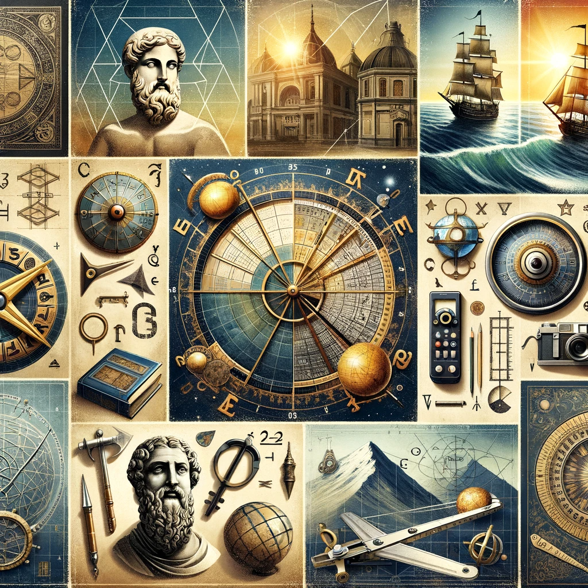

# Introduction

## Overview of the changing landscape of applied mathematics in higher education

The field of applied mathematics has undergone significant transformation in higher education. Once seen as a purely theoretical discipline, it has evolved into an integral component of various scientific and engineering endeavors. This transformation reflects the increasing importance of mathematical tools in solving real-world problems, from climate modeling to financial analysis.

## Your personal journey through the applied mathematics program

My journey through the applied mathematics program was a testament to this evolving landscape. Initially drawn to the beauty of abstract mathematical concepts, I soon discovered the immense potential of applying these theories to practical scenarios. This experience has not only enhanced my problem-solving skills but also broadened my perspective on the role of mathematics in the modern world.

# Historical Context

## Brief history of applied mathematics in higher education

Applied mathematics has a storied history in higher education. Its roots can be traced back to the needs of early civilizations for astronomical calculations and land measurements. However, it was during the Renaissance that applied mathematics began to emerge as a distinct field, with the development of techniques in navigation and engineering. The 20th century witnessed a rapid expansion of its scope, spurred by technological advances and the emergence of new disciplines like computer science.

## Evolution of the curriculum and focus areas over time

The curriculum of applied mathematics programs has continually adapted to the changing demands of society and technology. Early programs focused on arithmetic and geometry applicable to trades and commerce. With the Industrial Revolution, the focus shifted towards mechanics and engineering applications. In recent decades, the curriculum has expanded to include computational methods, data analysis, and interdisciplinary applications, reflecting the digitization of our world.

# Current State and Trends

## Description of the current state of applied mathematics programs (like at Sorbonne University)

Contemporary applied mathematics programs, such as those at Sorbonne University, embody a blend of traditional mathematical rigor and modern applicability. These programs offer a diverse range of courses, from numerical methods and statistical analysis to machine learning and network theory. They emphasize not only theoretical understanding but also practical skills in modeling and computation.

## Discussion of current trends and innovations in the field

Current trends in applied mathematics are shaped by the demands of data-driven industries and the advent of powerful computational tools. There is an increasing focus on algorithms, big data analytics, and machine learning. Innovations in these areas are not just expanding the boundaries of the field but are also enabling solutions to complex problems in science, engineering, and economics.

# Future Directions

## Predictions or insights into the future of applied mathematics in education

The future of applied mathematics in education is likely to be marked by even greater interdisciplinarity and technological integration. Programs will increasingly incorporate AI and machine learning techniques, adapting to the evolving landscape of digital technology. There will also be a greater emphasis on modeling complex systems, from environmental systems to human biology.

## How these programs are preparing students for the challenges of the future

These programs are equipping students with the tools to tackle the challenges of a rapidly changing world. By fostering skills in analytical thinking, computational techniques, and data analysis, they are preparing graduates to contribute meaningfully in diverse fields like renewable energy, financial technology, and public health.

# Conclusion

## Recap of the evolution and significance of applied mathematics in higher education

The journey of applied mathematics in higher education is a testament to the adaptability and relevance of this discipline. From its early practical applications to its current role in addressing modern challenges, it has continually evolved, reflecting the changing needs of society.

## Personal reflections on the importance of staying adaptable and informed in this field

In my personal experience, staying adaptable and informed in the field of applied mathematics has been crucial. The discipline’s evolving nature requires a constant learning mindset and the ability to apply mathematical principles to new and diverse problems. This adaptability not only enhances personal growth but also contributes to broader societal advancements.
